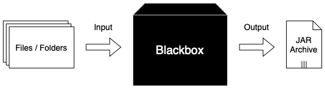

# GitDiffUpToDatePlugin


[](https://github.com/thahnen/UniformDependenciesPlugin/actions/workflows/gradle.yml)

Configure Gradle tasks of project to be UP-TO-DATE depending on Git diff result of files / folders provided to this
plugin. Circumventing boundaries which maybe cannot be solved at all or only by extensive configuration in Gradle.

## Use cases

Let's say your Gradle project produces a Jar archive using the task provided by the Gradle Java Plugin. But the source
files to be compiled and then be packed inside the Jar archive are generated / patched using some external logic
(e.g. Ant). A possible configuration looks like this:

```gradle
// import our so called Blackbox
ant.importBuild("Blackbox.xml") {
    "ant-$it"
}

tasks.named("classes") {
    dependsOn("ant-magic")
}
```

You know which files or folders are used by this imported Ant target named *ant-magic* but the Gradle task *classes*
can't set its output to be UP-TO-DATE. Maybe because the input files generated by the Ant target always input the
current date/time into the files and therefore the Gradle task *classes* assumes changes are made everytime even if the
input files or folders of the Ant target are static.

An abstract schematic of such a situation can look like the following image:



In the example above, when running the Gradle *jar* task, everything has to be executed / build again which might work
in a single project build but with a big monolith or multi project build this might become expensive over time.

This plugin should provide a simple solution to this problem while only working with the information also available to
the user:
- the input files or folders of the blackbox and the hidden processes inside (e.g. Ant targets)
- any task coming later in the graph after "executing" the blackbox

## Usage

To use this plugin you only need to apply it and hand over a simple configuration inside the projects gradle.properties
file including, as mentioned, a task after the possible blackbox and the necessary input files or folders:


```properties
# Necessary property: Map of task by name to necessary files or folders
# INFO: All paths must be relative to project directory!
plugins.gitdiffuptodate.config=\
  <task name> : folder, file 1, file 2;\
  <task name> : file 1, file 2, folder 1, folder 2

# Optional property: When working with tasks of type Jar should the Manifest file be evaluated, defaults to true
# INFO: Will store & evaluate the current Git commit hash using the attribute "Commit-Hash"
plugins.gitdiffuptodate.evaluateManifest=Boolean

# Optional property: When working with tasks of type Jar should the Git commit hashes of the last changes of the
#                    necessary files or folders be evaluated using the Manifest file, defaults to false
# INFO: Will store & evaluate the Hashes, the actual paths are encrypted for security reasons
plugins.gitdiffuptodate.useFileOrFolderHashes=Boolean
```

## Example

See the folders *prj-test-groovy* and *prj-test-kotlin* on how to use this plugin with a simple example each.
